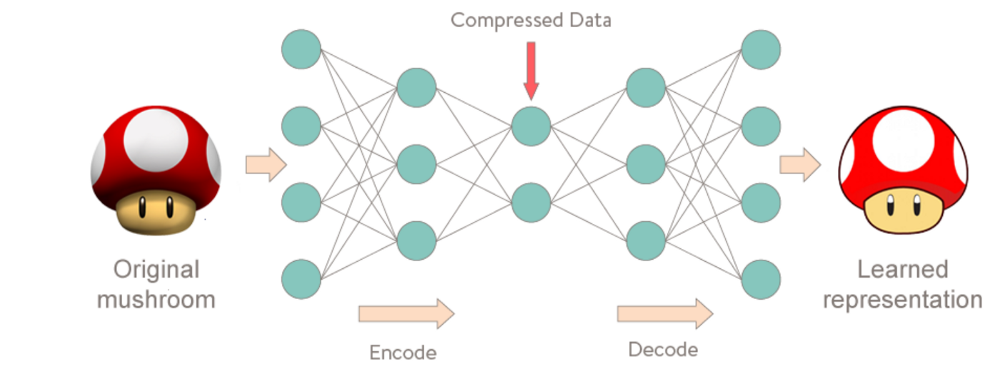

# Packet Capture Anomaly Detection and Analysis

### In this notebook, we will combine several popular python libraries for PCAP analysis to provide a framework for online, unsupervised anomaly detection and network analysis

This notebook is broken up into two sections: the first section investigates an online, unsupervised approach to network intrusion detection systems (NIDS) using the python package `Kitsune` and `KitNET`. The second section explores data analysis options using python's `pcapkit` library to extract packet payloads.

## Kitsune
[Kitsune](https://github.com/ymirsky/Kitsune-py) is an online network intrusion system based on an ensemble of autoencoders. Artificial neural networks (ANNs) have been successful in improving detection performance, as they are good at learning complex non-linear concepts from the input data. However, traditionally ANNs have been used in a supervised approach: having an expert collect and label normal and anomalous network patterns, training the model offline, embedding it on a router and running batch sets of data through the model to detect intrusion. This is not the most efficient solution for several reasons, cheifly being that the time it takes to label data for a supervised learning approach is impractical (as the training set should be customized to the network it is being used for), and since offline processing does not scale to demands of millions of packets being processed per hour.

Thus, Kitsune was invented as a solution to offer online, unsupervised, low complexity processing. The details of how Kitsune and KitNET, Kitsun'e anomaly detection algorithm, can be found in [this paper](https://github.com/ymirsky/Kitsune-py/blob/master/Kitsune%20paper.pdf), but we will briefly address how the logic of it works here.

### How Kitsune Works

<i>KitNET's Architectural Diagram <a href='https://github.com/ymirsky/Kitsune-py'>Source</a></i>

We chose Kitsune for this project as it provides the following traits that are needed for a NIDS framework:

- Highly scalable for processing full PCAP data and extracting features for an ANN
- unsupervised approach does not require subject matter expert labeling or maintenance
- can be offered online and operates on edge devices with limited compute and storage requirements

Kitsune operates by (1) monitoring the statistical patterns of recent network traffic, and (2) detecting anomalous patterns via an ensemble of autoencoders. The ensemble of autoencoders decodes a packet then re-encodes it based on weights it learned from the training portion of the process. It then compares the difference (as an RMSE score) between the original and re-contructed packet, where the higher the RMSE score, the more likely anomalous it is.  

<i>During training, autoencoder computes the difference (RMSE) between the   original data and it’s learned representation <a href='https://medium.com/@curiousily/credit-card-fraud-detection-using-autoencoders-in-keras-tensorflow-for-hackers-part-vii-20e0c85301bd'>Source 1</a> / <a hred='https://medium.com/@anno.ai/scalable-machine-learning-for-packet-capture-data-with-kubeflow-b485a64c870a'>Source 2</a></i>

#### <i> Implimentation notes from the creator:
<i>This python implimentation of Kitsune is is not optimal in terms of speed. To make Kitsune run as fast as described in the paper, the entire project must be cythonized, or implimented in C++.</i>.
